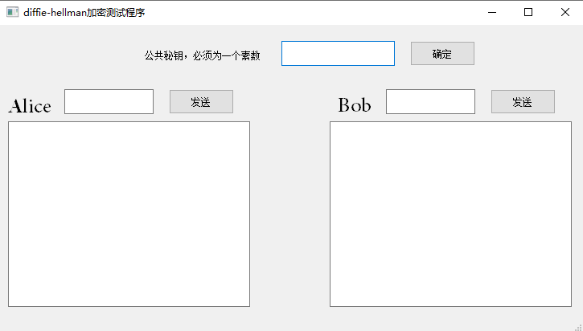
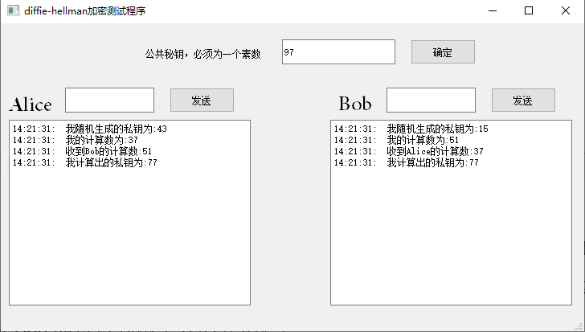
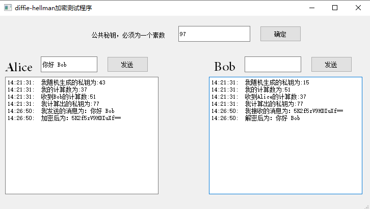

# Diffie-Hellman-crypto
 基于Python实现的Diffie-Hellman加密算法，密码学大作业，diffie-hellman加密程序，带有Pyqt前端界面，并使用位移密码实现与base64实现加密解密过程

## 运行实例：
运行代码，弹出Diffie-Hellman加密解密测试程序，如图可以看到，Alice与Bob两个不同的人在准备进行消息交流： 
 
为了实现Alice与Bob的信息加密交流，首先需要确定公共秘钥，对于Diffie-Hellman加密算法而言，公钥必须为一个大于2的素数，本次实验我们将公钥设置为97，单击确定，Alice与Bob即可得到两个人的公钥。 
 
随后Alice与Bob都已经知道了双方的公钥为77切没有通过中间人的传输。随后Alice即可通过加密算法向Bob发送通过base64转码后的偏移加密信息，然后Bob接收到加密信息，通过反偏移与Base64解密即可得到Alice发送的信息。 
 

### 食用方法
	python windwos.py
